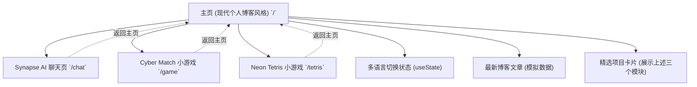

## 1. 架构设计

## 2. 技术说明
- **框架**：React 19 + Next.js 15 (App Router)
- **样式**：Tailwind CSS v4
- **组件结构 (主页重构)**：
  - `Navbar`：顶部固定或绝对定位的极简导航栏，包含 Logo 和语言切换按钮。
  - `Hero`：带有微弱渐变背景的大字号欢迎区。
  - `Projects`：基于 Grid 布局的项目展示区。
  - `Posts`：基于 Flex 列表布局的文章展示区。
  - `Footer`：底部版权与链接区。
- **多语言 (i18n)**：在 `/` 页面根组件使用 `useState` 维护中英文文本字典。

## 3. 路由定义
| 路由 | 目的 |
|-------|---------|
| `/` | 现代开发者个人博客主页（项目展示，文章列表，双语切换） |
| `/chat` | Synapse AI 聊天体验页（保持原样） |
| `/game` | 赛博翻牌游戏（保持原样） |
| `/tetris` | 霓虹俄罗斯方块（保持原样） |

## 4. 开发任务
1. **重构 `app/page.tsx`**：移除原本生硬的 GitHub Profile 结构，使用更自然、极简且有设计感的现代博客模板排版（如：居中内容流、大标题、精美的卡片设计）。
2. **重写多语言词典**：适配新的博客模板文本（Hero Slogan, Project Titles/Descriptions, Article Titles, etc.）。
3. **版本升版与发布**：执行构建测试，推送代码并升版至 `1.00`。