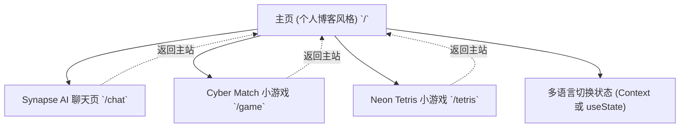

## 1. 架构设计

## 2. 技术说明
- **框架**：React 19 + Next.js 15 (App Router)
- **样式**：Tailwind CSS v4 (使用现有的 `globals.css` 配置，继续保留赛博朋克深色发光体系)
- **多语言 (i18n)**：在 `/` 下使用 `useState` 继续管理中文/English。由于新增了多个页面，理想情况是使用 Context 或继续在各个页面内传递状态/独立管理。为了简化开发且保持纯静态化，可在各个页面内通过 props、localStorage、或独立组件中封装切换。
- **图标**：推荐使用 Lucide React 图标（`lucide-react`）或内联 SVG。
- **打字机特效**：通过 `useEffect` 和 `setTimeout` 逐字展示字符，或者纯 CSS `animation: typing` 实现。
- **Markdown 渲染（AI 聊天模块）**：由于目前只是“体验页”，可以使用简单的预设回复流模拟交互，不需要完整的 `react-markdown` 渲染，除非用户输入了复杂的 prompt。

## 3. 路由定义
| 路由 | 目的 |
|-------|---------|
| `/` | 个人博客主页（项目橱窗，双语切换） |
| `/chat` | Synapse AI 聊天体验页 |
| `/game` | 赛博翻牌游戏（已有） |
| `/tetris` | 霓虹俄罗斯方块（已有） |

## 4. 数据模型 (前端状态)
### 4.1 Synapse AI 聊天状态
- `messages`: `Array<{ role: 'user' | 'ai', content: string, id: string }>`
- `isTyping`: boolean（控制思考状态和光标闪烁）
- `inputValue`: string（输入框当前值）

## 5. 开发任务
- 重新设计并编写 `app/page.tsx`。
- 新建 `app/chat/page.tsx`，并实现 `ChatInterface.tsx` 页面。
- 确认 `app/game/page.tsx` 和 `app/tetris/Tetris.tsx` 的“返回主站”导航。
- 提交时进行版本号 `0.50` 的升版。